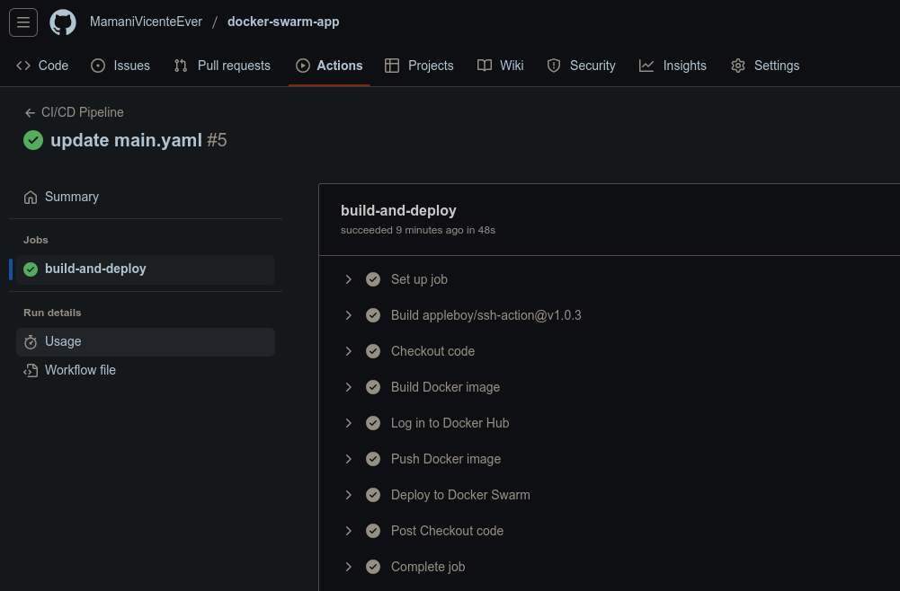
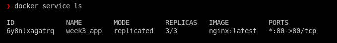

# Proyecto: CI/CD con Docker Swarm

Este proyecto implementa una aplicación contenerizada utilizando Docker Swarm, Docker Compose y un pipeline de CI/CD. Además, se aplican estrategias de despliegue como Rolling Updates y Blue-Green Deployment para garantizar alta disponibilidad y resiliencia.

---

## **Tabla de Contenidos**

1. [Descripción del Proyecto](#descripción-del-proyecto)
2. [Estructura del Repositorio](#estructura-del-repositorio)
3. [Configuración del Entorno](#configuración-del-entorno)
4. [Despliegue de la Aplicación](#despliegue-de-la-aplicación)
5. [Pipeline CI/CD](#pipeline-cicd)
6. [Estrategias de Despliegue](#estrategias-de-despliegue)
7. [Capturas de Pantalla](#capturas-de-pantalla)
8. [Problemas y Soluciones](#problemas-y-soluciones)

---

## **Descripción del Proyecto**

El objetivo de este proyecto es demostrar cómo integrar herramientas modernas de DevOps, como Docker Swarm y GitHub Actions, para crear un sistema de despliegue continuo. La aplicación utiliza una interfaz visual animada que simula nodos en un clúster de Docker Swarm y permite interactuar con estrategias de despliegue como Rolling Updates y Blue-Green Deployment.

---

## **Estructura del Repositorio**

La estructura del repositorio está organizada de la siguiente manera:

```
.
├── docker-compose.yml       # Archivo para definir servicios y redes en Docker Swarm
├── Dockerfile               # Archivo para construir la imagen Docker
├── html                     # Carpeta con los archivos de la aplicación web
│   ├── docker-logo.png      # Logotipo de Docker
│   ├── index.html           # Página principal de la aplicación
│   ├── script.js            # Lógica interactiva de la aplicación
│   └── styles.css           # Estilos CSS para la aplicación
└── README.md                # Documentación del proyecto
```

---

## **Configuración del Entorno**

### **Requisitos Previos**
- Sistema operativo: Linux (Ubuntu recomendado).
- Docker y Docker Compose instalados.
- Git instalado.
- Cuenta en GitHub para configurar el pipeline CI/CD.

### **Pasos para Configurar Docker Swarm**
1. Inicializa Docker Swarm:
   ```bash
   docker swarm init --advertise-addr 192.168.1.64
   ```
2. Verifica el estado del clúster:
   ```bash
   docker node ls
   ```

---

## **Despliegue de la Aplicación**

### **Paso 1: Clonar el Repositorio**
Clona este repositorio en tu máquina local:
```bash
git clone git@github.com:MamaniVicenteEver/docker-swarm-app.git
cd docker-swarm-app
```

### **Paso 2: Desplegar el Servicio**
Usa Docker Compose para desplegar la aplicación en Docker Swarm:
```bash
docker stack deploy -c docker-compose.yml my-app
```

### **Paso 3: Verificar el Servicio**
Verifica que el servicio esté en ejecución:
```bash
docker service ls
```

Accede a la aplicación en tu navegador:
```
http://192.168.1.64/
```

---

## **Pipeline CI/CD**

### **Configuración del Pipeline**
El pipeline CI/CD está configurado en GitHub Actions. El archivo `.github/workflows/ci-cd.yml` contiene las siguientes etapas:

1. **Checkout del Código**: Descarga el código del repositorio.
2. **Construcción de la Imagen**: Construye la imagen Docker de la aplicación.
3. **Publicación en Docker Hub**: Sube la imagen al registro de Docker Hub.
4. **Actualización del Servicio**: Actualiza el servicio en Docker Swarm.

### **Secretos Requeridos**
Agrega los siguientes secretos en la configuración de GitHub:
- `DOCKER_USERNAME`: Tu nombre de usuario de Docker Hub.
- `DOCKER_PASSWORD`: Tu contraseña de Docker Hub.

---

## **Estrategias de Despliegue**

### **Rolling Updates**
Simula una actualización gradual de los nodos en el clúster:
1. Haz clic en el botón "Simular Actualización" en la aplicación.
2. Observa cómo los colores de las esferas cambian gradualmente, representando la actualización de los nodos.

### **Blue-Green Deployment**
Cambia entre dos versiones de la aplicación:
1. Haz clic en el botón "Cambiar Versión".
2. Observa cómo los colores de las esferas cambian completamente, representando el cambio entre las versiones Blue y Green.

---

## **Capturas de Pantalla**

### **Interfaz de la Aplicación**
  
*Interfaz principal de la aplicación con animaciones y botones interactivos.*

### **Pipeline CI/CD**
  
*Pipeline CI/CD en GitHub Actions mostrando las etapas completadas.*

### **Redes en Docker Swarm**
  
*Redes creadas en Docker Swarm usando el driver `overlay`.*

---

## **Conclusión**

Este proyecto demuestra cómo integrar herramientas modernas de DevOps para crear un sistema de despliegue continuo. La aplicación visualiza conceptos clave como Docker Swarm, CI/CD y estrategias de despliegue, haciendo que el aprendizaje sea interactivo y práctico.
